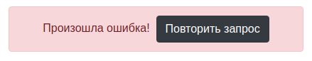

https://alexwebart.github.io/ra-redux-observable

Поиск
===

Взяв за основу проект, рассмотренный на лекции, доработайте его либо напишите с нуля:

1. При пустой форме ввода список не отображается, **в state он должен быть пустым**.
2. Выводится сообщение: «Type something to search...».

===

Список и детали
===

Напишите проект, использующий React Router и Redux Observable, который удовлетворяет следующим условиям:

1. На главной странице показывается список услуг, редактирование не нужно, достаточно просто ссылок — данные загружаются методом GET на http://localhost:7070/api/services.
1. При переходе по ссылке (/:id/details), загружаются детали услуги — GET на http://locahost:7070/api/services/:id.

При загрузке должен отображаться индикатор загрузки, что на странице списка, что на странице деталей:

При ошибке должно показываться сообщение об ошибке и кнопка «Повторить запрос», при нажатии на которую осуществляется попытка снова выполнить запрос с индикатором загрузки и т. д.:

Готовый бэкенд расположен в каталоге `backend`.

